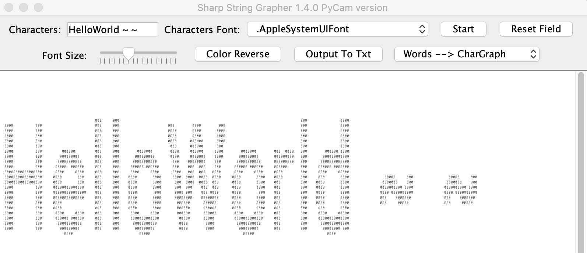

# Character-Artist 

[Download the Jar!](https://github.com/ZhongxuanWang/Character-Artist/raw/master/out/artifacts/CharGrapher_java_jar/CharGrapher-java.jar)

## Introduction:  
- Character-Artist (also called Sharp CharGrapher) is a software created by JAVA that could 
	- convert images to characters' representation of photos (aka CRP)
	- convert camera captured content to CRP
	- convert plain words / sentences to CRP
	- convert images to Hexadecimal
  
## Environment Build
1> Install Python (recommend python 3.5 and above). (<a href="https://www.python.org/ftp/python/3.8.0/python-3.8.0-macosx10.9.pkg">download Python3.8 for MacOS</a>)   
2> Install `opencv-python` by typing <code>pip install opencv-python</code>' in Terminal.  
3> Install Java. (JDK8 and above recommended) (<a href="https://www.java.com/en/download/mac_download.jsp">download latest Java for MacOS</a>). 
  

## Special In-Program Notice:  
  
 
- **Use the camera mode in a bright environment is recommended** since it will be easier to distinguish your face from the background 
  
## FRQ
- How to play?
	- After downloading or having all the things set up, type `java -jar CharGrapher.jar` into the terminal. (substitute the path for the jar file in 'Jar Path')
 
 - Are there any libraries used besides those lib in python?
	 - No. The java file only involves using Frame intensively (built-in lib), and no other java libraries involved. Thus it's a somehow very light-weight and easy-to-play project!

- Which is the main Java class?
	- It's called CharGrapher.java located in src folder.

